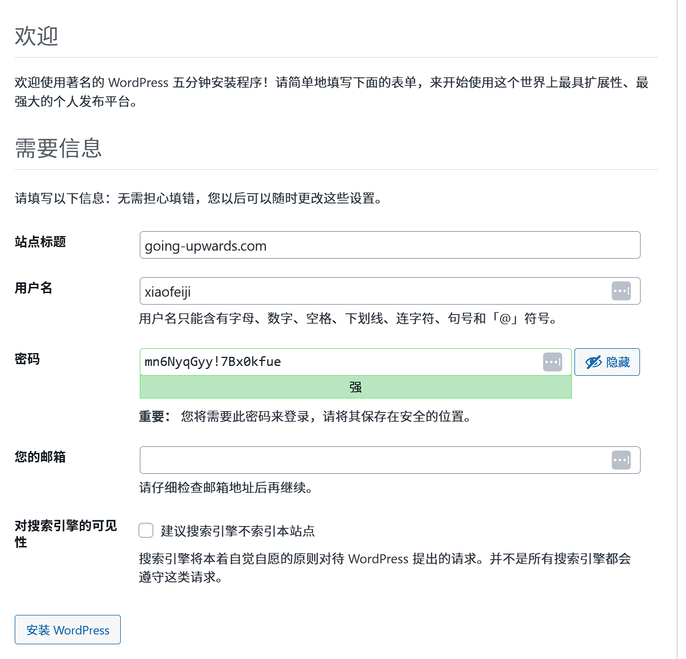

# 天气

今日天气：晴朗
位置：德州市
体感温度：寒冷

# 今日关键字：奥莱；老照片；怀旧

下午我们去了德州的奥莱，两位老人对购物不感兴趣，我们主要去了怀旧区，看了很多老照片。说是老照片，其中大概四分之一的照片我并不觉得老，那大概就是我老了吧。

# 灵机一动

- 

# 健康

## 口服类补剂

日常服用B族维生素；钙片；辅酶Q10；DHA；脑力提升综合类胶囊（NMN，PQQ，神经酸，磷脂酰丝氨酸（PS））；精氨酸，瓜氨酸。
## 运动

安装宝塔面板，管理地址： http://166.88.11.232:38592/ 

[1Panel 2026-02-27 13:38:57 install Log]: 请使用您的浏览器访问面板:  
[1Panel 2026-02-27 13:38:57 install Log]: 外部地址:  http://[2400:8d60:6::f395:b3b3]:18101/4552b01490 
[1Panel 2026-02-27 13:38:57 install Log]: 内部地址:  http://166.88.141.140:18101/4552b01490 
[1Panel 2026-02-27 13:38:57 install Log]: 面板用户:  85bf93038e 
[1Panel 2026-02-27 13:38:57 install Log]: 面板密码:  51aa480623 
[1Panel 2026-02-27 13:38:57 install Log]:  
[1Panel 2026-02-27 13:38:57 install Log]: 官方网站: https://1panel.cn 
[1Panel 2026-02-27 13:38:57 install Log]: 项目文档: https://1panel.cn/docs 
[1Panel 2026-02-27 13:38:57 install Log]: 代码仓库: https://github.com/1Panel-dev/1Panel 
[1Panel 2026-02-27 13:38:57 install Log]: 前往 1Panel 官方论坛获取帮助: https://bbs.fit2cloud.com/c/1p/7 
[1Panel 2026-02-27 13:38:57 install Log]:  
[1Panel 2026-02-27 13:38:57 install Log]: 如果您使用的是云服务器，请在安全组中打开端口 18101 
[1Panel 2026-02-27 13:38:57 install Log]:  
[1Panel 2026-02-27 13:38:57 install Log]: 为了您的服务器安全，离开此屏幕后您将无法再次看到您的密码，请记住您的密码。 
[1Panel 2026-02-27 13:38:57 install Log]:  
[1Panel 2026-02-27 13:38:57 install Log]: ================================================================ 

mn6NyqGyy!7Bx0kfue

#### 访问密钥 ID
3fa713f1faced9674e78e66d6f94e81a
#### 机密访问密钥
acad8cfd435a1dfbaa33d66323e192206a9bcf8f7d07f3a2072ff3c727631c8d