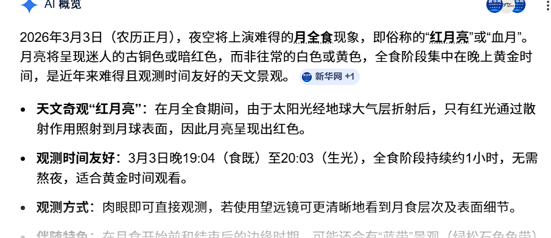

# 天气

今日天气：晴朗
位置：德州市
体感温度：寒冷

# 今日关键字：元宵节

投资：股票亏了一千多块。止盈没做好，昨天市场那么热，应该考虑止盈的；不亏是基础，止盈和止损是关键。类似的情况出现不止一次了，似乎也算是一个模型？下次有类似的情况试着改变操作手法。石油大涨，三桶油竟然同时涨停，可以说很罕见了。逻辑很清晰，但是我没敢买，之所以没敢买的原因也是前几天听说石油波动性强，其实也没仔细考虑逻辑是什么，错失机会了。
运动：下午去爬山了，过年整个假期就没爬过，不过并没觉得很累，看来体力还是在线的。
朋友：曹盖生日，早上在群里祝他生日快乐了。他说媳妇可能给他买蛋糕。
亲人：我妈打电话给我说要看月亮，但是今天阴天，没得看。

思考：很多灵光一现当时觉得能记住，实际上啥也记不得，看来想到什么就得立刻去记录。
新品：Kimi的最新模型2.5可以完成网站复刻

# 灵机一动

- 最近搞钱的几个点子：
	- 做一个工具类网站，通过google adsence赚钱
	- 开通Youtube和B站等，发视频赚钱，视频可以是技术类的比如建站、github小项目分享、翻墙技术（自带流量）等。
	- 薅羊毛？从程序员哈利那里看来的，说是能免费获得一些数字货币？
	- 打粉
	- obsidian这种类型的软件，很多人也不知道是免费的，竟然也可以在闲鱼卖
	- 淘宝、闲鱼、小红书卖猫砂，需要和明哥合作。
	- Openclaw自动化完成一些小项目，教人配置赚钱
	- 自动化虚拟商品，比如天眼查会员自动发货等等。
	- 做一个分享类网站，比如电子书？然后靠广告赚钱？

# 健康

## 口服类补剂

日常服用B族维生素；钙片；辅酶Q10；DHA；脑力提升综合类胶囊（NMN，PQQ，神经酸，磷脂酰丝氨酸（PS））；精氨酸，瓜氨酸。
## 运动

